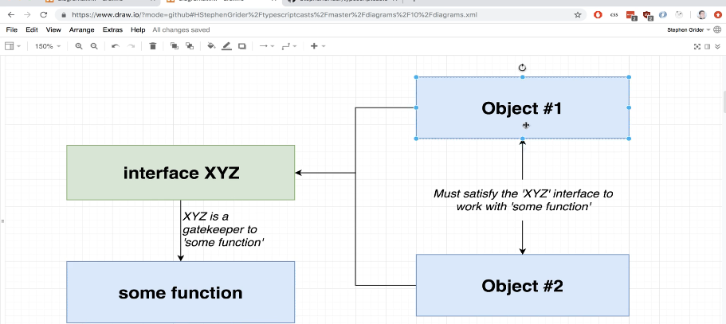
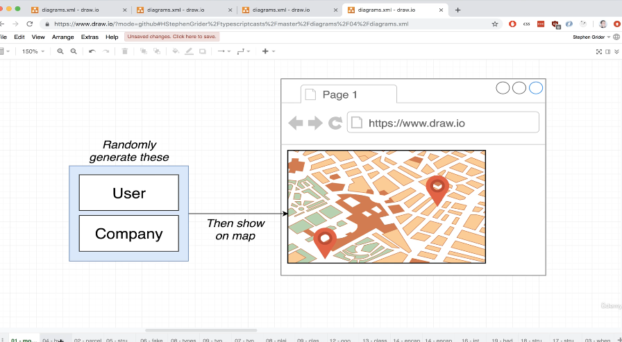
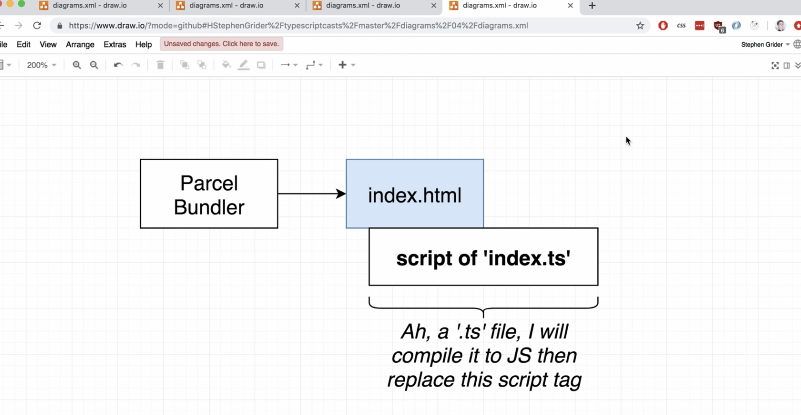
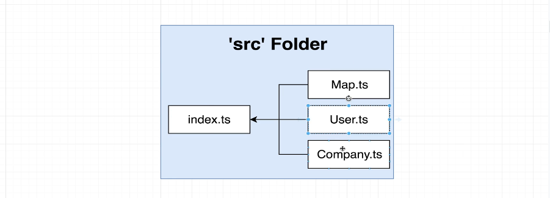
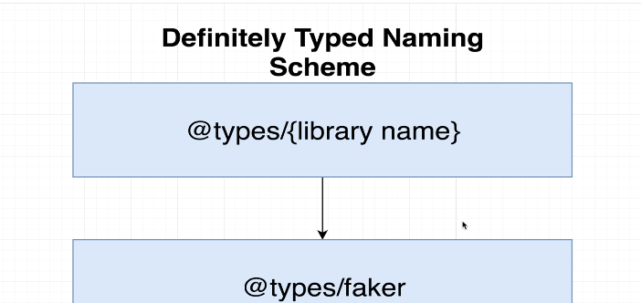

# Typescript - StephenGrider - Basics of Typescript

### NOTE: Section 01 to Section 09 - Basics of Typescript

- Basics of Typescript -77 lessons (77 lessons (5h 41min))
- NOTE: this section has been extracted to its own repository: [typescript-stephengrider-basics-of-typescript](https://github.com/clarklindev/typescript-stephengrider-basics-of-typescript)
- this section is also covered in courses:
  - [microservices-with-node-js-and-react](https://www.udemy.com/course/microservices-with-node-js-and-react/) - section 25: appendix B - basics of typescript
    - [my git repository](https://github.com/clarklindev/microservices-stephengrider-with-node-and-react)
  - [typescript-the-complete-developers-guide](https://www.udemy.com/course/typescript-the-complete-developers-guide) - section 01 to section 09
    - [my git repository](https://github.com/clarklindev/typescript-stephengrider-typescript-complete-developers-guide)
  - [react-and-typescript-build-a-portfolio-project](https://www.udemy.com/course/react-and-typescript-build-a-portfolio-project) - section 26: Appendix:Typescript
    - [my git repository](https://github.com/clarklindev/typescript-stephengrider-typescript-portfolio)

---

## Table of contents

### Section 01 to Section 09 - basics of typescript

- [Section 01 - Getting started with TypeScript](#section-01---getting-started-with-typescript)

1. How to Get Help (1min)
2. Join Our Community! (1min)
3. Course Resources (1min)
4. Typescript Overview (6min)
5. Environment Setup (8min)
6. Important Axios and TypeScript Version Information (1min)
7. A First App (5min)
8. Executing Typescript Code (5min)
9. One Quick Change (4min)
10. Catching Errors with Typescript (7min)
11. Catching More Errors! (5min)

- [Section 02 - What is a Type System](#section-02---what-is-a-type-system)

12. Do Not Skip - Course Overview (4min)
13. Types (5min)
14. More on Types (6min)
15. Examples of Types (5min)
16. Where Do We Use Types? (1min)

- [Section 03 - Type Annotations in Action](#section-03---type-annotations-in-action)

17. Type Annotations and Inference (2min)
18. Annotations with Variables (5min)
19. Object Literal Annotations (7min)
20. Annotations Around Functions (6min)
21. Understanding Inference (4min)
22. The 'Any' Type (8min)
23. Fixing the 'Any' Type (2min)
24. Delayed Initialization (3min)
25. When Inference Doesn't Work (5min)

- [Section 04 - Annotations with Functions and Objects](#section-04---annotations-with-functions-and-objects)

26. More on Annotations Around Functions (5min)
27. Inference Around Functions (6min)
28. Annotations for Anonymous Functions (2min)
29. Void and Never (3min)
30. Destructuring with Annotations (4min)
31. Annotations Around Objects (7min)

- [Section 05 - Mastering Typed Arrays](#section-05---mastering-typed-arrays)

32. Arrays in Typescript (5min)
33. Why Typed Arrays? (5min)
34. Multiple Types in Arrays (3min)
35. When to Use Typed Arrays (1min)

- [Section 06 - Tuples in TypeScript](#section-06---tuples-in-typescript)

36. Tuples in Typescript (4min)
37. Tuples in Action (5min)
38. Why Tuples? (3min)

- [Section 07 - The All Important Interface](#section-07---the-all-important-interface)

39. Interfaces (1min)
40. Long Type Annotations (5min)
41. Fixing Long Annotations with Interfaces (5min)
42. Syntax Around Interfaces (4min)
43. Functions in Interfaces (5min)
44. Code Reuse with Interfaces (4min)
45. General Plan with Interfaces (3min)

- [Section 08 - Building Functionality with Classes](#section-08---building-functionality-with-classes)

46. Classes (4min)
47. Basic Inheritance (3min)
48. Instance Method Modifiers (7min)
49. Fields in Classes (6min)
50. Fields with Inheritance (4min)
51. Where to Use Classes (1min)

- [Section 09 - Design Patterns with TypeScript](#section-09---design-patterns-with-typescript)

52. Updated Parcel Instructions (1min)
53. App Overview (3min)
54. Bundling with Parcel (5min)
55. Project Structure (3min)
56. IMPORTANT Info About Faker Installation (1min)
57. Generating Random Data (5min)
58. Type Definition Files (5min)
59. Using Type Definition Files (6min)
60. Export Statements in Typescript (5min)
61. Defining a Company (5min)
62. Note on Generating an API Key (1min)
63. Adding Google Maps Support (8min)
64. Required Update for New @types Library (1min)
65. Google Maps Integration (4min)
66. Exploring Type Definition Files (3min)
67. Hiding Functionality (6min)
68. Why Use Private Modifiers? Here's Why (8min)
69. Adding Markers (9min)
70. Duplicate Code (3min)
71. One Possible Solution (7min)
72. Restricting Access with Interfaces (6min)
73. Implicit Type Checks (3min)
74. Showing Popup Windows (7min)
75. Updating Interface Definitions (7min)
76. Optional Implements Clauses (6min)
77. App Wrapup (8min)

---

## Section 01 - getting started with typescript

### 1. How to Get Help (1min)

- @ste_grider
- udemy Q&a

### 2. Join Our Community! (1min)

### 3. Course Resources (1min)

### 4. Typescript Overview (6min)

- adding a type-system
- catch errors during development
- adding 'type annotations'
- no performance optimizations

### running the code

- typescript (js + annotations) -> typescript compiler -> js

### 5. Environment Setup (8min)

- install typescript compiler -> `npm install -g typescript ts-node`

  - ts-node -> allows compile AND run code using single command
  - `tsc --help`
  - vscode typescript add-on
  - install vs-code prettier
  - add .prettierrc

  ```.prettierrc
  {
  "tabWidth": 2,
  "useTabs": false,
  "printWidth": 80,
  "semi": true,
  "singleQuote": true,
  "trailingComma": "es5"
  }
  ```

  - enable format on save:
    `CTRL + ,` -> search and enable 'Format On Save'

### 6. Important Axios and TypeScript Version Information (1min)

- when using latest axios need types: `npm install --save-dev @types/node`
- TS 5.6 has breaking changes (ts-node not nsync)
- install typscript v5.5 `npm install -g typescript@5.5`
  - this fixes `Cannot use import statement outside a module` errors

### 7. A First App (5min)

#### A basic api fetching data

- see project files: [/tutorial-stephengrider-typescript-01-basic-example](./tutorial-stephengrider-typescript-01-basic-example)
- TODO: make a network request to fetch some JSON and print the result
- TODO: create a project folder
  - i've named mine: `tutorial-stephengrider-typescript-01-basic-example`
  - go into folder
- TODO: create node project `npm init -y`
- TODO: create index.js

#### installs

- install axios
- install ts-node
- install typescript

```shell
npm i axios
npm i --save-dev ts-node typescript
```

#### fetch data using json typicode (jsonplaceholder.typicode.com)

- https://jsonplaceholder.typicode.com/todos
- https://jsonplaceholder.typicode.com/todos/1

### 8. Executing Typescript Code (5min)

```shell
# compile -> creates index.js
tsc index.ts
```

```ts
import axios from 'axios';
const url = 'https://jsonplaceholder.typicode.com/todos/1';

axios.get(url).then((response) => {
  console.log(response.data);
});
```

- run the js

```shell
node index.js
```

- expected output:

```cmd
{ userId: 1, id: 1, title: 'delectus aut autem', completed: false }
```

```json
// package.json
  "scripts": {
    "test": "echo \"Error: no test specified\" && exit 1",
    "build": "tsc index.ts",
    "dev": "node index.js",
    "start": "ts-node index.ts"
  },
```

- ts-node (compile + run)
- NOTE: running ts-node on its own does not create output .js file (like with tsc)

### 9. One Quick Change (4min)

- makes some mistakes in code: passing wrong variable names
- does not have type checking

### 10. Catching Errors with Typescript (7min)

- below is the finished code (with Typescript)
- added an interface: defining structure of an object

```js
//index.ts
import axios from 'axios';

const url = "https://jsonplaceholder.typicode.com/todos/1";

//TYPESCRIPT: interface
interface Todo{
  id: number;
  title: string;
  completed: boolean;
}

axios.get(url).then(response => {
  const todo = response.data as Todo;  //TYPESCRIPT: as interface

  const id = todo.id;
  const title = todo.title;
  const completed = todo.completed;

  logTodo(id, title, completed);

});

//TYPESCRIPT: give type annotations to function parameters
const logTodo = (id:number, title: string, completed:boolean) => {
  console.log(`${id} ${title} ${completed}`)
}
```

### 11. Catching More Errors! (5min)

- created the logTodo function
- error was the order of arguments passed in
  - FIX: give the arguments types so it picks up if wrong prop passed-in

## Section 02 - What is a type system

### 12. Do Not Skip - Course Overview (4min)

#### learning Typescript:

- syntax + features
  - focus on this first, then design patterns
- design patterns with TS (FOCUS OF COURSE)
  - eg. how to use interfaces to write re-usable code

#### course goals

- Syntax + features - section 2 - understanding basic types in TS
- Syntax + features - section 3 - Function typing + annotations
- Syntax + features - Type definition files
- Syntax + features - arrays in TS
- Syntax + features - modules systems
- Syntax + features - classes + refresher on OOP
- design pattern - Projects

- for each of the topics
  - definition
  - why?
  - examples
  - when to use

---

### 13. Types (5min)

- Type -> easy way to refer to the different properties and functions that a value has

### 14. More on Types (6min)

- 2 categories of types:
  - primitive types -> string, number, boolean, void, undefined, null, symbol
  - Object types -> functions, arrays, classes, objects
- Types - used by typescript compiler to analyze code for errors
- Types - allow other devs to understand what data values are in the codebase

### 15. Examples of Types (5min)

- autocomplete once we assigned type as Date

```ts
const date = new Date();
```

- Class

```ts
class Color {}
const red = new Color();
```

### 16. Where Do We Use Types? (1min)

- where are types used -> everywhere

---

## Section 03 - Type annotations in action

### 17. Type Annotations and Inference (2min)

- type annotation -> code we add to let Typescript know what type of value a variable refers to
- type inference -> typescript tries to figure out what type of value a variable refers to

- `type annotations` AND `type inference` apply differently for:
  - variables
  - functions
  - objects

### 18. Annotations with Variables (5min)

- annotation -> `:type`

```ts
const apples: number = 5; //:number is an annotation
```

### 19. Object Literal Annotations (7min)

#### array type annotation:

- `string[]` an array of strings
- `number[]` array of numbers
- `boolean[]` array of booleans

```ts
//Array
let colors: string[] = ['red', 'green', 'blue']; //annotation: array of strings
let numbers: number[] = [1, 2, 3];
let booleans: bool[] = [true, false, false];
```

#### classes type annotations:

- `Car`'s type starts with capital (so its a class type)

```ts
//Class
class Car {}
let car: Car = new Car();
```

#### object literal type annotations:

- when the annotation is an object

```ts
//Object
let point: { x: number; y: number } = {
  x: 20,
  y: 23,
};
```

### 20. Annotations Around Functions (6min)

- when the annotation type is a function.
- function annotation -> the function annotation define the props it receives, and the return type

```ts
//function
const logNumber: (i: number) => void = (i: number) => {
  console.log(i);
};
```

### 21. Understanding Inference (4min)

- so if we remove the annotations, typescript infers the type -> meaning based on the value it determines the type.
- when you make a variable (there is a left and right of equals sign)
  - variable declaration -> left of =
  - variable initialization -> right of =

#### automatic inference

- automatic inference (typescript figures out whats the type) -> same line declaration and initialization
- when do we use type inference?
  - always use type inference

```ts
const color = 'red'; //automatic inference because declaration (left) and initialization (right) are on same line
```

#### when do we add annotations?

- 3 senarios for ADDING annotations:
  - when function returns 'any' type and we need to clarify the type
  - when we declare a variable on one line then initialize it later
  - when we want a variable to have a type that cant be inferred

### 22. senario: The 'Any' Type (8min)

- when function returns `any` type
- ie. response from axios call / `JSON.parse()` -> typescript cant figure out return type because JSON.parse() depends on input string value and can yield varying results/types.

```ts
const json = '{"x":10, "y":20}';
const coordinates = JSON.parse(json); //coordinates has type `any`
console.log(coordinates);
```

```cmd
{x: 10, y:20}
```

### 23. Fixing the 'Any' Type (2min)

```ts
//...

const coordinates: { x: number; y: number } = JSON.parse(json); //FIX by adding type

//...
```

### 24. senario: Delayed Initialization (3min)

- when we declare a variable on one line and initialize it later
- when variable declaration and value assignment not on same line

```ts
let words = ['red', 'green', 'blue'];
let foundWords: boolean; //fix by adding type annotation

for (let i = 0; i < words.length; i++) {
  if (words[i] === 'green') {
    foundWord = true;
  }
}
```

### 25. senario: When Inference doesn't Work (5min)

- eg. variable is reassigned a value with different type

```ts
let numbers = [-10, -1, 12];
let numbersAboveZero: false | number = false; //FIX: we give it a type of either: false OR number

for (let i = 0; i < numbers.length; i++) {
  if (numbers[i] > 0) {
    numbersAboveZero = numbers[i];
  }
}
```

## Section 04 - Annotations with functions and objects

### 26. More on Annotations Around Functions (5min)

- before we were adding annotations for the variable declaration (left-side of equals sign)
- this section deals with annotations/inference for the right side of equals sign (ie the function arguments and return value)
- type annotations for function
  - code we add to tell typescript what type of arguments a function will receive and what type of values it will return
- type inference for functions
  - typescript tries to figure out what type of value a function will return
  - there is no type inference for function arguments
  - type inference is only for return type of function BUT we will always annotate the return type

```ts
//here we annotate return type as :number
const add = (a: number, b: number): number => {
  return a + b;
};
```

### 27. Inference Around Functions (6min)

- typescript ensures correct return value by inferring return value (but not correct logic inside function)
- we always annotate return type (this is for arrow functions, named functions, anonymous functions assigned to variable type) because there are times when we can forget to return something...and typecript will infer return as 'void'
- `:void` return type for return null or undefined

### 28. Annotations for Anonymous Functions (2min)

- arrow function
- anonymous function
- assigned function

```ts
//arrow function
const subtract = (a: number, b: number): number => {
  return a - b;
};

//anonymous function
function divide(a: number, b: number): number {
  return a / b;
}

//assigned function
const multiply = function (a: number, b: number): number {
  return a * b;
};
```

### 29. Void and Never (3min)

- `:void` -> there is no return

- `:never`
  - when we ONLY throw errors and dont return something so there is no way function will complete
  - if the function eventually returns something but could throw error, its return type is still for a success completion case

```ts
//never
const throwError = (message: string): never => {
  throw new Error(message);
};
```

### 30. Destructuring with Annotations (4min)

#### BEFORE

```ts
const todaysWeather = {
  date: new Date(),
  weather: 'sunny',
};

const logWeather = (forecast: { date: Date; weather: string }): void => {
  console.log(forecast.date);
  console.log(forecast.weather);
};

logWeather(todaysWeather);
```

- destructuring date, and weather out of forecast
- you can do this by replacing `forecast` with the props you want to get out of `forecast`
  - NOTE: the annotation type and destructure are separate

#### AFTER

```ts
const todaysWeather = {
  date: new Date(),
  weather: 'sunny',
};

const logWeather = (
  //<destructure of `forecast`> : <annotation>
  {
    date,
    weather,
  }: {
    date: Date;
    weather: string;
  }
): void => {
  console.log(date);
  console.log(weather);
};

logWeather(todaysWeather);
```

### 31. Annotations Around Objects (7min)

```ts
const profile = {
  name: 'alex',
  age: 20,
  coords: {
    lat: 0,
    lng: 15,
  },
  setAge(age: number): void {
    this.age = age;
  },
};
```

- normal object destructuring `age` out of `profile`

```ts
const { age } = profile;
```

#### annotation for destructured 'profile'

- with annotations -> add `: <structure of profile object>`
- to understand this: `{age}` is the destructured object prop, so to annotate, add: `{the expected attribute of profile structure}`

```ts
const { age }: { age: number } = profile; //with annotation for destructured 'profile'
```

#### annotation for destructured 'profile' prop 'coords' (which is also an object)

- to understand this: `{coords: { lat, lng }}` is the destructured object prop
- so to annotate, add: `{the expected attribute of profile structure}` eg. `{ coords: { lat: number; lng: number } } `
- note: `{the expected attribute of profile structure}` is an object to allow destructing multiple props out of 'profile'

```ts
const {
  coords: { lat, lng },
}: { coords: { lat: number; lng: number } } = profile; //with annotation for destructured 'profile'
```

---

## Section 05 - Mastering Typed Arrays

### 32. Arrays in Typescript (5min)

- typed arrays - arrays where each element has a consistent type
- type inference looking at values stored
- initializing empty arrays -> add annotation

```ts
const carMakers: string[] = ['ford', 'toyota', 'chevy']; //with annotation, but without the annotation there is auto type inference
```

- 2d array (type annotation is optional)

```tS
const carsByMake:string[][] = [['ford'], ['mazda'], ['bmw']];
```

### 33. Why Typed Arrays? (5min)

- type inference when pulling value out of array
- adding incompatible values
- Array has helper functions
- flexible (arrays can contain multiple different types)

### 34. Multiple Types in Arrays (3min)

- override type inference by adding annotation (eg. when initializing with empty array)

```ts
const importantDates: (Date | string)[] = [new Date()];
```

### 35. When to Use Typed Arrays (1min)

- when to use? -> when you have a collection of records with some arbitary sort order

## Section 06 - Tuples in Typescript

### 36. Tuples in Typescript (4min)

- with tuple, the annotation describes the type of the properties and order of the values
- difference -> array like structure, BUT.. each element represents some property of a record
- array example: `[brown , true, 40]` there is loss of information because we dont know what the properties are associated with which values - so order is important and needs to be remembered

#### type alias

- you can replace tuple structure by defining a type alias

```ts
type Drink = [string, boolean, number]; //type alias
```

### 37. Tuples in Action (5min)

- eg. plain object

```ts
//eg. plain object
const drink = {
  color: 'brown',
  carbonated: true,
  sugar: 40,
};
```

- eg. array

```ts
//array
const pepsi = ['brown', true, 40];
```

- same same
  - `const pepsi: [string, boolean, number];`
  - `const pepsi: Drink;`

```ts
//type alias
type Drink = [string, boolean, number]; //type alias

//tuple
const pepsi: [string, boolean, number] = ['brown', true, 40];

//using type alias
const pepsi: Drink = ['brown', true, 40];
const sprite: Drink = ['clear', true, 40];
const tea: Drink = ['brown', false, 0];
```

### 38. Why Tuples? (3min)

- NOTE: prefer using objects because object keys have meaning whereas tuples only define the value type and order
- wont use it often... maybe with .csv file
- wont use it because even with the type defined in a tuple (order of values in tuple, the type has no meaning),

```ts
const carSpecs: [number, number] = [400, 3354];
```

- using an object instead because there are meaningful 'keys'

```ts
const carStats = {
  horsePower: 400,
  weight: 3345,
};
```

## Section 07 - The all important interface

### 39. Interfaces (1min)

- create a new type describing the property names and value types of an object
- ie. creating a new type (a custom type just like 'string' or 'number')

### 40. Long Type Annotations (5min)

- this is just an example of using a long type annotation (not using interface)
- wont use this way, because everytime you have a function receiving `oldCivic` you have to type out the long annotation type

```ts
const oldCivic = {
  name: 'civic',
  year: 2000,
  broken: true,
};

const printVehicle = (vehicle: {
  name: string;
  year: number;
  broken: boolean;
}): void => {
  console.log(
    `name: ${vehicle.name}, year: ${vehicle.year}, broken: ${vehicle.broken}`
  );
};
```

### 41. Fixing Long Annotations with Interfaces (5min)

- adding an interface
- generic name for interface (capital case)

```ts
interface Vehicle {
  name: string;
  year: number;
  broken: boolean;
}

const oldCivic = {
  name: 'civic',
  year: 2000,
  broken: true,
};

const printVehicle = (vehicle: Vehicle): void => {
  console.log(
    `name: ${vehicle.name}, year: ${vehicle.year}, broken: ${vehicle.broken}`
  );
};

printVehicle(oldCivic);
```

### 42. Syntax Around Interfaces (4min)

- interfaces can have properties of complex type eg. Date
- interfaces can have functions:

```ts
//interface with function
interface Vehicle{
  //...
  year: Date; //complex type
  summary(): string {
    return `name is: ${this.name}`;
  };
}
```

- full example

```ts
interface Vehicle {
  name: string;
  year: Date; //complex type
  broken: boolean;
  summary(): string; //function type
}

const oldCivic = {
  name: 'civic',
  year: new Date(),
  broken: true,
  summary(): string {
    return `name is: ${this.name}`;
  },
};

const printVehicle = (vehicle: Vehicle): void => {
  console.log(vehile.summary());
};

console.log(oldCivic.summary());
```

### 43. Functions in Interfaces (5min)

- when typescript tries to decide if an object is of a type, the object can have more properties than the interface requires BUT not less
- FIX -> with example below, we change interface `Vehicle` to `Reportable` because technically, `printVehicle` function only needs to receive a type with summary()
- FIX -> the function `PrintVehicle` does not need to be called `printVehicle` anymore, it can just be generic `printSummary`

```ts
interface Reportable {
  summary(): string; //function type
}

const printSummary = (item: Reportable): void => {
  console.log(item.summary());
};
```

### 44. Code Reuse with Interfaces (4min)

- we made the code more generic to be reusable
- NOTE: civic and drink both have `summary()` function so they are both of type `Reportable`
  - meaning both objects can use `printSummary`
- as long as these objects abide by an interface, we can create generic functions that receive objects that satisfy the interface type
- the function can be used with any object that satisfies the `Reportable` interface

```ts
const drink = {
  color: 'brown',
  carbonated: true,
  sugar: 40
  summary():string{
    return `my drink has ${sugar} grams of sugar`
  }
}

const printSummary = (item: Reportable): void => {
  console.log(item.summary());
};

printSummary(oldCivic);
printSummary(drink);

```

### 45. General Plan with Interfaces (3min)



- using interfaces for gatekeeping/compatible to functions is way we get reusability with typescript.

- ie. create functions that are typed with interfaces
- make objects satisfy the interface to use the generic function
- make use of 'as TYPE' to type some data to an interface
- Make interfaces for axios response.data objects

```ts
interface Todo {
  id: number;
  title: string;
  completed: boolean;
}

axios.get(url).then((response) => {
  const todo = response.data as Todo; //TYPESCRIPT: as interface
});
```

- give type annotations to function parameters ( `parameters` are what you can pass to a function and `arguments`
  are actually values passed in a function)

---

## Section 08 - Building functionality with classes

### 46. Classes (4min)

- class is a blueprint -> to create an object with some fields (values) and methods (functions) to represent an idea
- How we will learn classes

1. learn about class methods (function)

   - then you can call eg.`vehicle.drive();`

2. learn about class fields (values)

```ts
class Vehicle {
  drive(): void {
    console.log('hello');
  }

  honk(): void {
    consol.log('honk');
  }
}

const vehicle = new Vehicle();
vehicle.drive();
vehicle.honk();
```

### 47. Basic Inheritance (3min)

- you can extend a class
- you can redefine methods in a class that extends another class that has a method with same name

```ts
class Vehicle {
  drive(): void {
    console.log('hello');
  }

  honk(): void {
    consol.log('honk');
  }
}

class Car extends Vehicle {
  drive(): void {
    console.log('vroom');
  }
}

const car = new Car();
//car has access to all 'Vehicle' methods
car.drive(); //prints 'vroom'
```

### 48. class method modifiers (7min)

- keywords you can place on methods -> `public` (default), `private`, `protected`
- goal is to restrict access to functions and variables (FOR OTHER DEVELOPERS)
  - public (DEFAULT) -> method can be called anywhere, anytime
  - private -> only be called by other methods in this class (NOT from the instance)
  - protected -> can be called by other methods in this class OR by other methods in child classes.
- NOTE: on overriding modifier: if parent class has a modifier, you cannot change the modifier in child class.

```ts
class Vehicle {
  public drive(): void {
    console.log('hello');
  }

  public honk(): void {
    consol.log('honk');
  }
}

class Car extends Vehicle {
  private drive(): void {
    console.log('vroom');
  }

  startDriving(): void {
    this.drive();
  }
}

const car = new Car();
car.drive();
car.honk();
```

- NOTE: if Car class has drive() method set-up as 'private', it cannot be accessed via the instance, only from internally within the class eg. `startDriving()`

```ts
class Car {
  private drive() {}

  startDriving() {
    this.drive();
  }
}

const car = new Car();
// car.drive();  //error
car.startDriving(); //ok
car.honk();
```

### 49. Fields in Classes (6min)

- adding fields to classes
- traditionally you have to initialize variables in classes with a value and if you want to pass a value in, you define a constructor
- you either initialize variable on same line in class OR inside constructor BUT best is to just define the access modifier with the prop value/type and remove the variable declaration and initializing inside the constructor
- simple syntax where instance variable is also created and assigned when value passed in:
- passed in constructor prop value of 'private', cant access from outside the class (ie. cant access from instance )
- passed in constructor prop value of 'protected', cant access from outside the class BUT can from within child classes

```ts
class Vehicle {
  // color: string;
  // constructor(color: string) {
  //   this.color = color;
  // }

  constructor(public color: string) {} //simple syntax where instance variable is also created and assigned when value passed in

  public drive(): void {
    console.log('hello');
  }

  public honk(): void {
    console.log('honk');
  }
}
```

### 50. Fields with Inheritance (4min)

- NOTE: parent class receives 'color', so child class must pass this in
- NOTE: WHEN CHILD CLASS DOES NOT HAVE CONSTRUCTOR -> `class Car` calls the parent's constructor
- NOTE: WHEN CHILD CLASS HAS CONSTRUCTOR it needs to abide by its own constructor AND parent constructor via 'super()'
  - and pass in required props to super() for the parent
- NOTE: because parent constructor has modifier specified, the child class DOES NOT define a modifier
  - you do not define modifier in child class because you want to use the parent's variable

```ts
class Vehicle {
  // color: string;
  // constructor(color: string) {
  //   this.color = color;
  // }

  constructor(public color: string) {} //simple syntax where instance variable is also created and assigned when value passed in

  public drive(): void {
    console.log('hello');
  }

  public honk(): void {
    console.log('honk');
  }
}

class Car extends Vehicle {
  constructor(public wheels: number, color: string) {
    super(color);
  }

  private drive(): void {
    console.log('vroom');
  }

  startDriving(): void {
    this.drive();
  }
}

const car = new Car(4, 'red');
car.drive();
car.honk();
```

### 51. Where to Use Classes (1min)

- Classes allow strong code reuse

---

---

## Section 09 - Design Patterns with Typescript

### 52. Updated Parcel Instructions (1min)

- Parcel tool can be run without installation using npx
- To build the app and run the development server, simply run the following command in your terminal:

```cmd
npx parcel index.html
```

### 53. App Overview (3min)



- project folder: `/tutorial-stephengrider-typescript-02-designpatterns-googlemaps/`
- TODO: web app (browser) randomly generate (User OR Company) and show it on google map

### 54. Bundling with Parcel (5min)



- `npm i -g parcel` (note: install globally)
- parcel will help get typscript working in browser (instead of `ts-node`)
  - NOTE: By default Parcel does not perform any code transpilation. This means that if you write your code using modern language features, that’s what Parcel will output. You can declare your app’s supported browsers using the browserslist field. When this field is declared, Parcel will transpile your code accordingly to ensure compatibility with your supported browsers.

1. parcel reads project folder/index.html looks for `<script>` tag, sees its .ts (typescript)

- NOTE: add type='module' to `<script>` tag ie. `<script type="module" src="./src/index.ts"></script>`

2. converts the .ts to .js
3. then updates the `<script>` to make use of the coverted .js instead of .ts

#### running the app

- NOTE: package.json has scripts: but this is not working...
- NOTE: Parcel has a development server built in, which will automatically rebuild your app as you make changes. To start it, run the parcel CLI pointing to your entry file
- FIX: use commandline and run parcel pointing to starting file (from project directory): `parcel index.html`

#### V1 (DEPRECATED)

- NOTE: v1 is no longer maintained -> `https://v2.parceljs.org/getting-started/migration`

  - FIX: uninstall: `npm uninstall parcel-bundler` (uninstall if you installed parcel-bundler)

#### V2

- FIX: install: "parcel": "^2.0.0"
- FIX: `.cache` folder replaced with `.parcel-cache` (add both to .gitignore)
- NOTE: Parcel 2 matches browser behavior: classic `<script>` tags do not support imports or exports. Use a `<script type="module">` element to reference a module.
- `Server running at http://localhost:1234`

### 55. Project Structure (3min)



- index.ts
  - User.ts
  - Company.ts
  - Map.ts

### 56. IMPORTANT Info About Faker Installation (1min)

- [faker.js](https://github.com/faker-js/faker)
- https://fakerjs.dev/
- currently v9
- as of faker v6 typscript support is native and does not require installing of @types
- To use this library, you can install it by running:

```cmd
pnpm i @faker-js/faker --save-dev
```

### faker usage

```ts
import { faker } from '@faker-js/faker';
```

### 57. Generating Random Data (5min)

```ts
//src/User.ts
// import faker from 'faker';
import { faker } from '@faker-js/faker'; //forked version of faker import syntax

import { Mappable } from './CustomMap';

export class User implements Mappable {
  name: string;
  location: {
    lat: number;
    lng: number;
  };

  constructor() {
    this.name = faker.name.firstName();
    this.location = {
      lat: parseFloat(faker.address.latitude()),
      lng: parseFloat(faker.address.longitude()),

  }

  markerContent(): string {
    return `user Name: ${this.name}`;
  }
}
```

### 58. Type Definition Files (5min)

- if you see the error `Could not find the declaration module 'faker'`
  - this happens because in your project you can import and use js libraries, but if your project is a typescript project, then it wants to know types for functions/variables. but if the library is a js library, typescript wont know/how to figure out the types..
- FIX:
  - type definition files tell typescript function available inside library
  - can be included with library
    
- popular libraries have type definition files already created by [definitelytyped](github.com/definitelyTyped) that start with:
- `pnpm i @types/{library name}`
- start project `parcel index.html`

### 59. Using Type Definition Files (6min)

- with the type installed, on the import if you hold down CTRL (windows), you can click on the type definition class (index.d.ts)
- no implemention only definition types
- with class definition: `class User{ location:{lat:number, lng:number}}`
- we are responsible for object initialization (in constructor) and properties inside eg. location = {}

```ts
//src/User.ts
export class User {
  name: string;
  location: {
    lat: number;
    lng: number;
  };

  constructor() {
    this.name = faker.name.firstName();
    this.location = {
      lat: parseFloat(faker.address.latitude()),
      lng: parseFloat(faker.address.longitude()),
    };
  }
}
```

### 60. Export Statements in Typescript (5min)

- add `export` to class then import to use
- in typescript, convention is to not use `export default` keyword
- always use import with `import {} from` syntax

```ts
//index.ts
import { User } from './User';

const user = new User();
console.log(user);

const map = new CustomMap('map');
map.addMarker(user);
//...
```

### 61. Defining a Company (5min)

```ts
//src/Company.ts
import faker from 'faker';
import { Mappable } from './CustomMap';

export class Company implements Mappable {
  name: string;
  catchPhrase: string;
  location: {
    lat: number;
    lng: number;
  };

  constructor() {
    this.name = faker.company.companyName();
    this.catchPhrase = faker.company.catchPhrase();
    this.location = {
      lat: parseFloat(faker.address.latitude()),
      lng: parseFloat(faker.address.longitude()),
    };
  }

  markerContent(): string {
    return `
    <h1>Company Name: ${this.name}</h1>
    <h3>CatchPhrase ${this.catchPhrase}</h3>
    `;
  }
}
```

```ts
//index.ts
import { User } from './User';
import { Company } from './Company';

//...

const user = new User();
console.log(user);

const company = new Company();
console.log(company);

//...
```

### 62. Note on Generating an API Key (1min)

### 63. Adding Google Maps Support (8min)

### 64. Required Update for New @types Library (1min)

### 65. Google Maps Integration (4min)

### 66. Exploring Type Definition Files (3min)

### 67. Hiding Functionality (6min)

### 68. Why Use Private Modifiers? Here's Why (8min)

### 69. Adding Markers (9min)

### 70. Duplicate Code (3min)

### 71. One Possible Solution (7min)

### 72. Restricting Access with Interfaces (6min)

### 73. Implicit Type Checks (3min)

### 74. Showing Popup Windows (7min)

### 75. Updating Interface Definitions (7min)

### 76. Optional Implements Clauses (6min)

### 77. App Wrapup (8min)

---
